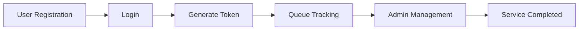

<div align="center">

# 🚀 Virtual Queue Manager


<br>


### 🌟 A Smart Solution to Eliminate Long Waiting Lines

#### 🏥 Hospitals • 🏦 Banks • 🏢 Offices • 🎓 Institutions • 🍽 Restaurants

</div>

---

# ✨ Features

🔐 Secure User Authentication

🎫 Digital Token Generation

📊 Real-Time Queue Monitoring

👨‍💼 Admin Dashboard

⚡ Fast and Responsive UI

📱 Mobile Friendly Design

☁️ Firebase Integration

🔔 Future Notification Support

---

# 🛠️ Tech Stack

<p align="center">


</p>

---

# 📂 Project Structure

```text
Virtual-Queue-Manager
│
├── index.html
├── login.html
├── register.html
├── dashboard.html
├── queue.html
├── css/
├── js/
├── assets/
└── firebase-config.js
```

---

# 🚀 Getting Started

### Clone Repository

```bash
git clone https://github.com/Abi-1429/Virtual-Queue-Manager.git
```

### Move into the Project Folder

```bash
cd Virtual-Queue-Manager
```

### Configure Firebase

✔ Enable Authentication

✔ Enable Firestore Database

✔ Add Firebase Configuration

### Run the Application

```bash
Open index.html
```

or launch using **VS Code Live Server**.

---

# 🎯 Applications

🏥 Hospital Appointment Management

🏦 Bank Queue Management

🏢 Government Service Centers

🎓 Educational Institutions

🍽 Restaurants and Cafeterias

🛠 Customer Service Centers

---

# 🔮 Future Enhancements

✅ QR Code Based Token System

✅ Email Notifications

✅ SMS Alerts

✅ AI Wait-Time Prediction

✅ Mobile Application

✅ Analytics Dashboard

✅ Multi-Branch Support

---

# 📈 Project Workflow



---

# 🤝 Contributing

Contributions are always welcome!

```bash
Fork → Create Branch → Commit → Push → Pull Request
```

---

# 👩‍💻 Author

<div align="center">

## 🌸 M ABIRAMI

### 💻 Full Stack Web Developer

Passionate about building smart and efficient web solutions.

<a href="https://github.com/Abi-1429">

</a>

</div>

---

<div align="center">


## ⭐ If you like this project, give it a star!

### Made with ❤️ by M ABIRAMI

</div>
